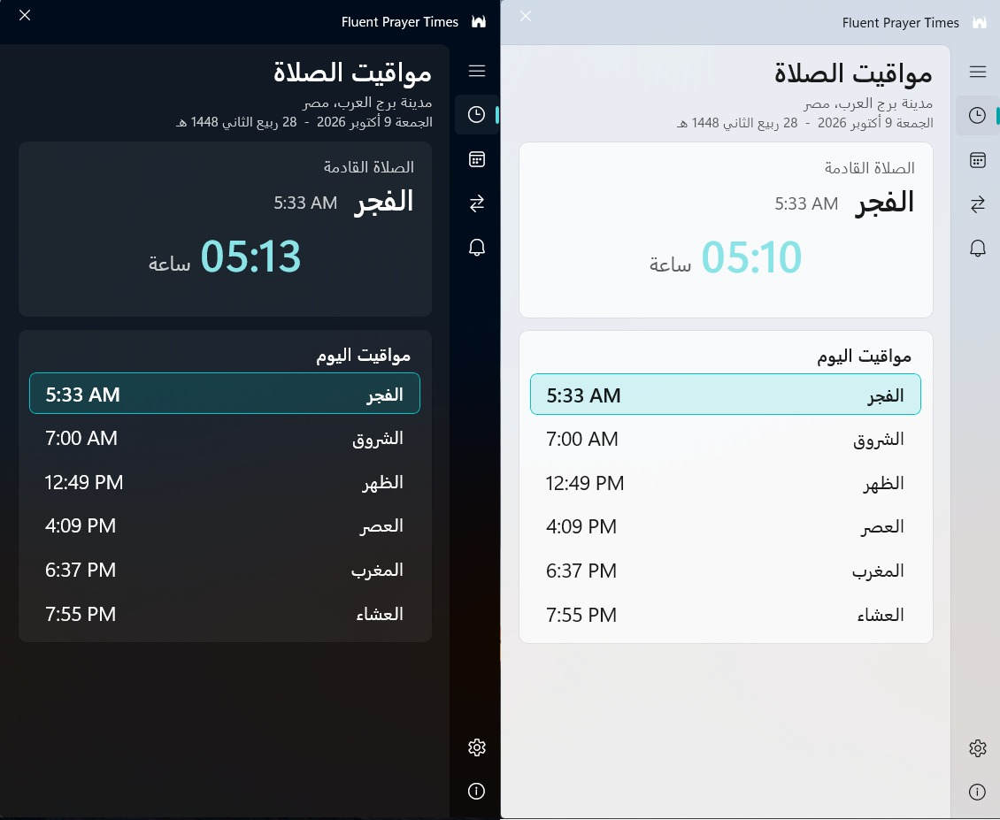
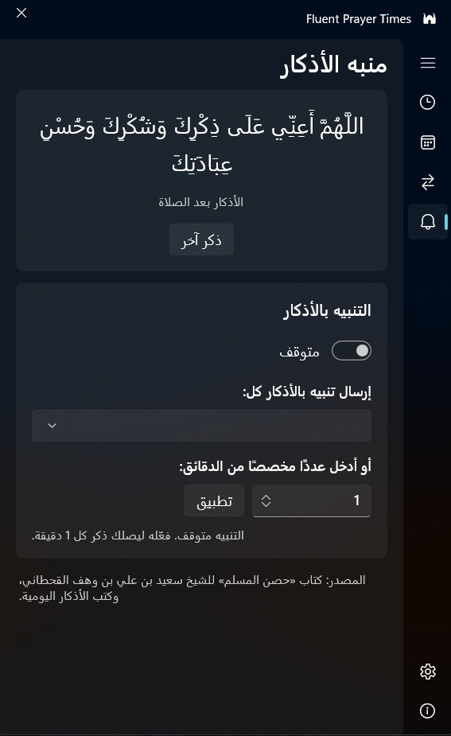
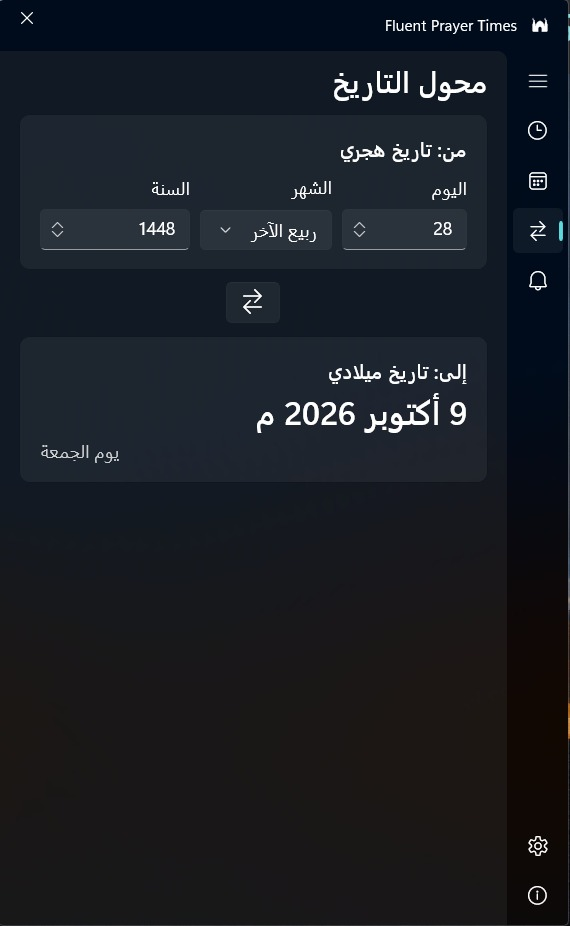
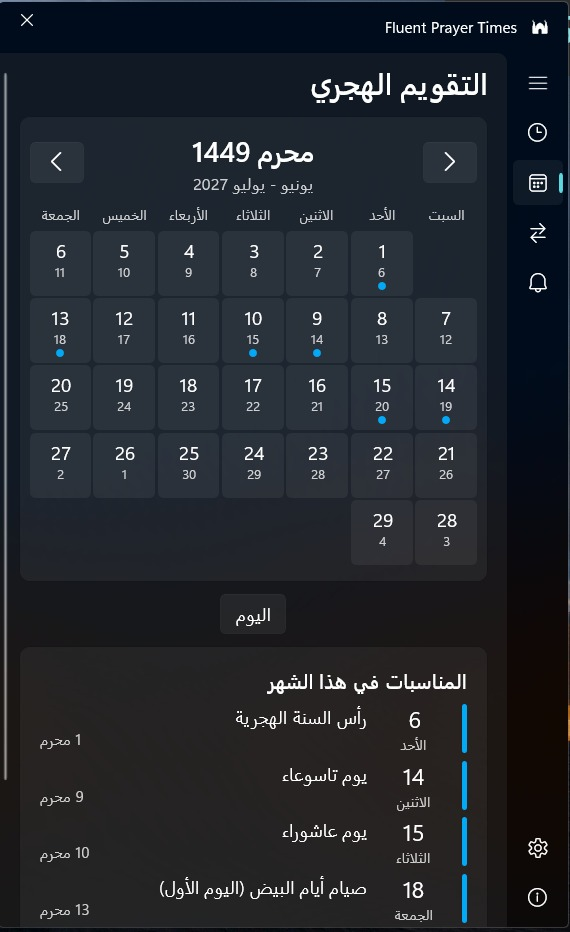
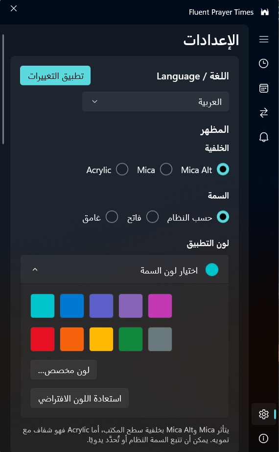

# 🕌 Fluent Prayer Times
### مواقيت الصلاة لنظام Windows

[English](README.en.md) · **العربية**

برنامج خفيف لمواقيت الصلاة بتصميم Windows 11 الأصيل (WinUI 3)، يبقى في منطقة الإشعارات ويُذكّرك بالصلاة القادمة والإقامة. الواجهة بـ 11 لغة، وتتبع لغة Windows تلقائيًا.

*brought to you by app.instinct AI* · تطوير: محمد النجار

## لقطات الشاشة / Screenshots

<strong>النافذة الرئيسية بالمظهرين الفاتح والغامق</strong>  
  
مواقيت الصلاة اليومية والعدّاد التنازلي للصلاة القادمة.

<table>
<tr>
<td align="center" valign="top" width="50%" dir="rtl">
<strong>منبه الأذكار</strong>  
  
عرض الذكر وإعداد فترة التذكير.
</td>
<td align="center" valign="top" width="50%" dir="rtl">
<strong>محوّل التاريخ</strong>  
  
تحويل التاريخ الهجري إلى التاريخ الميلادي.
</td>
</tr>
<tr>
<td align="center" valign="top" width="50%" dir="rtl">
<strong>التقويم الهجري</strong>  
  
أيام الشهر والمناسبات الإسلامية، وأسهم الأشهر تنعكس في الواجهات العربية.
</td>
<td align="center" valign="top" width="50%" dir="rtl">
<strong>الإعدادات</strong>  
  
اللغة وزر «تطبيق التغييرات»، والمظهر، ولون التطبيق.
</td>
</tr>
<tr>
<td colspan="2" align="center" dir="rtl">
<strong>بطاقة التمرير فوق الأيقونة</strong>  
  
الوقت المتبقي للصلاة القادمة مع المدينة وموعد الصلاة.
</td>
</tr>
<tr>
<td colspan="2" align="center" dir="rtl">
<strong>ويدجت سطح المكتب</strong>  
  
اسم الصلاة القادمة وموعدها والعدّاد التنازلي.
</td>
</tr>
</table>

## ✨ المميزات

**المواقيت والتذكير**
- **عدّاد الصلاة القادمة** بصيغة ساعة:دقيقة، مع التاريخ الهجري والميلادي.
- **الأذان والإقامة**: عند دخول الوقت تظهر عبارة «حان وقت الاذان» لمدة دقيقة، ثم عدّ تنازلي للإقامة، ثم عبارة «حان وقت الاقامة». مدة الإقامة قابلة للضبط لكل صلاة.
- **أصوات الأذان والإقامة**: افتراضي أو مختصر أو كامل، من إعدادات الإشعارات.
- **تنبيه بالأذكار**: صفحة «منبه الأذكار» ترسل إشعارًا بذكر قصير كل مدة تحددها (من 1 دقيقة فصاعدًا)، من «حصن المسلم» وكتب الأذكار اليومية، ويمكن تفعيله وإيقافه. نصوص الأذكار بالعربية في كل اللغات.
- **أي مدينة في العالم**: بحث عن المدينة أو تحديد الموقع تلقائيًا أو إدخال الإحداثيات، مع دعم التوقيت الصيفي.

**التقويم والتاريخ**
- **التقويم الهجري**: تقويم شهري مع الانتقال بين الأشهر والعودة إلى اليوم. اتجاه أسهم التنقل ينعكس في الواجهات من اليمين إلى اليسار.
- **أيام ومواعيد المناسبات الإسلامية**: قائمة «المناسبات في هذا الشهر» تعرض المناسبات الإسلامية وتواريخها (مثل المولد النبوي الشريف وذكرى الإسراء والمعراج).
- **محوّل التاريخ** بين الهجري والميلادي.

**الحضور على سطح المكتب**
- **أيقونة في منطقة الإشعارات** مع بطاقة تظهر عند التمرير بالفأرة وقائمة بالزر الأيمن. الضغط على الأيقونة يفتح الصفحة الرئيسية دائمًا، وليس آخر صفحة تركتها.
- **ويدجت سطح المكتب** عائم، يُحرَّك بالسحب ويلتصق بأقرب موضع.
- نافذة بتصميم Windows 11 الأصيل بارتفاع أكبر يتسع للمحتوى.

**اللغات والاتجاه**
- **11 لغة**: العربية والإنجليزية والفرنسية والألمانية والإسبانية والتركية والأردية والإندونيسية والروسية والبرتغالية والفارسية. ترجمات اللغات غير العربية والإنجليزية آلية.
- **اختيار اللغة** من الإعدادات، والخيار «تلقائي» يتبع لغة Windows.
- **اتجاه كامل من اليمين إلى اليسار** للعربية والأردية والفارسية: القائمة الجانبية على اليمين، وشريط العنوان ينعكس فيصير العنوان على اليمين وزر الإغلاق على اليسار.
- زر **«تطبيق التغييرات»** في أعلى الإعدادات يعيد تشغيل البرنامج لتفعيل تغيير اللغة أو لون السمة.

**المظهر**
- خلفية Mica Alt أو Mica أو Acrylic، ومظهر فاتح أو غامق أو بحسب النظام.
- **لون التطبيق**: ألوان جاهزة ولون مخصص من منتقي الألوان، واستعادة اللون الافتراضي.
- تشغيل مع Windows، ويعمل دون اتصال بعد أول تحميل للمواقيت.

**التحديثات والتثبيت**
- **تحقق تلقائي من التحديثات** عند التشغيل ثم كل ست ساعات، مع إشعار فيه زر تنزيل مباشر. يمكن إيقافه من الإعدادات، والتحقق اليدوي متاح من الإعدادات أو من قائمة الأيقونة.
- **تحديث بتنزيل صغير**: يُنزَّل المثبّت الصغير (بدون .NET) بدل المثبّت الكامل.
- **مثبّت بواجهة حديثة**: زر تثبيت، وشريط تقدم أخضر، وشاشة إتمام، وتشغيل تلقائي بعد التثبيت، واختصار على سطح المكتب وفي قائمة ابدأ.
- صفحة **«عن البرنامج»** تعرض رقم الإصدار الفعلي وأيقونة التطبيق ورابط **GitHub Repo Link** لمستودع المشروع.

## 📦 التثبيت
1. نزّل `FluentPrayerTimes-vX.Y.Z-installer-win-x64.exe` من صفحة [Releases](../../releases/latest) وشغّله.
2. إذا ظهر SmartScreen فاضغط **More info** ثم **Run anyway** (البرنامج غير موقَّع).

نسخة portable (ملف zip) ومثبّت صغير يتطلب .NET 8 Desktop Runtime متاحان أيضًا في الصفحة نفسها.

**المتطلبات:** Windows 10 (1809 أو أحدث) / Windows 11، بمعمارية x64، و[Windows App Runtime 1.6](https://aka.ms/windowsappsdk/1.6/latest/windowsappruntimeinstall-x64.exe) (يُثبَّت مرة واحدة، ويتولى المثبّت الأمر عند الحاجة).

## 🕋 مصدر المواقيت
المواقيت من [Aladhan API](https://aladhan.com/prayer-times-api) بطريقة الهيئة المصرية العامة للمساحة (الطريقة 5) افتراضيًا.

## 📄 الترخيص
[MIT](LICENSE) © محمد النجار · brought to you by app.instinct AI
