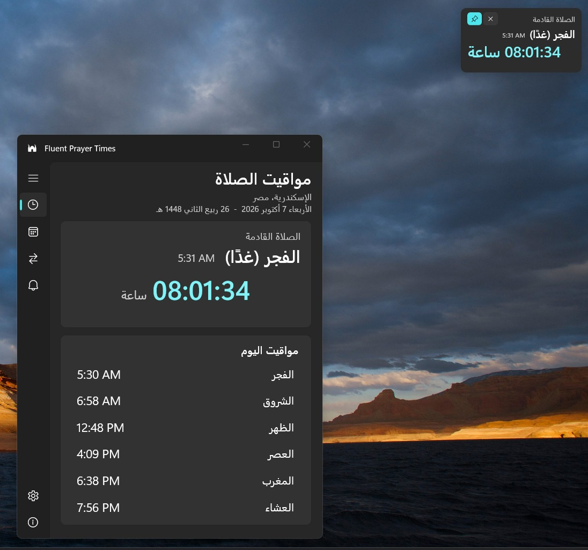
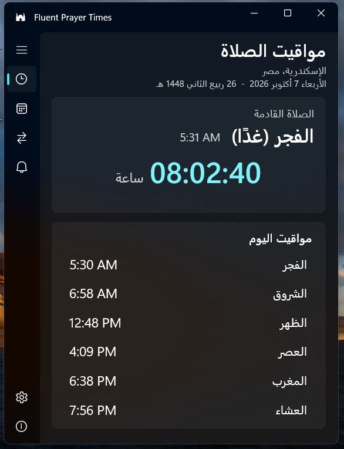
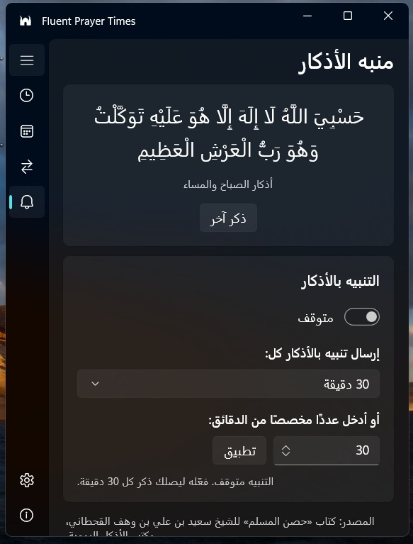
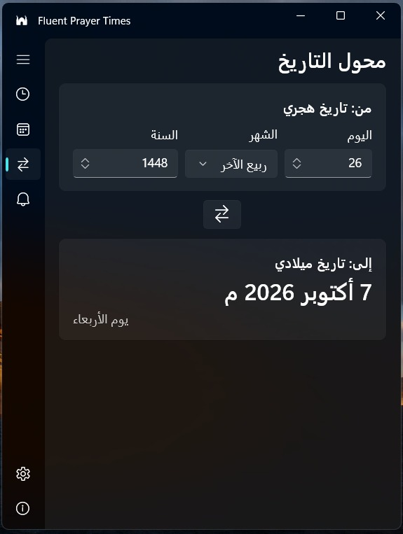
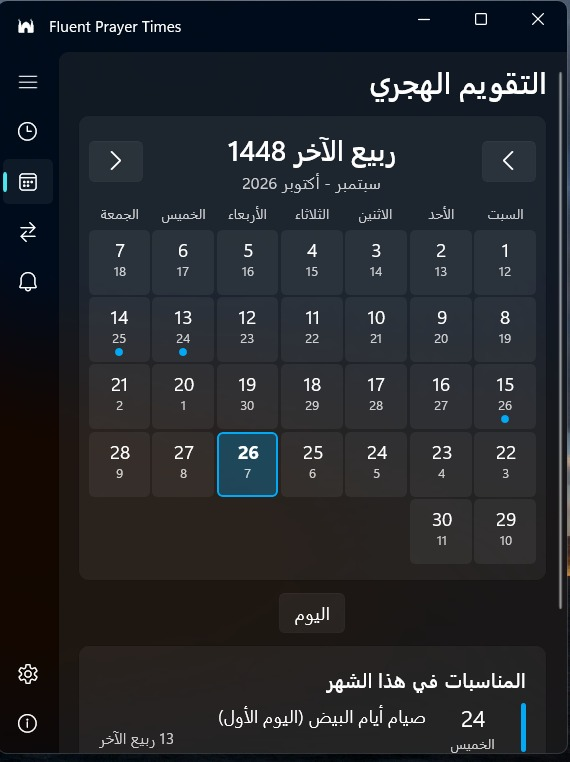
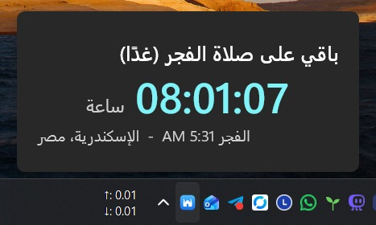
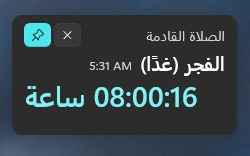

# 🕌 Fluent Prayer Times
### مواقيت الصلاة لنظام Windows

برنامج خفيف لمواقيت الصلاة بتصميم Windows 11 الأصيل (WinUI 3)، يبقى في منطقة الإشعارات ويُذكّرك بالصلاة القادمة والإقامة.

*brought to you by app.instinct AI* · تطوير: محمد النجار

## لقطات الشاشة / Screenshots

<strong>النافذة الرئيسية مع ويدجت سطح المكتب</strong>  
  
عرض المواقيت مع إبقاء عدّاد الصلاة القادمة ظاهرًا على سطح المكتب.

<table>
<tr>
<td align="center" valign="top" width="50%" dir="rtl">
<strong>النافذة الرئيسية</strong>  
  
مواقيت الصلاة اليومية والعدّاد التنازلي للصلاة القادمة.
</td>
<td align="center" valign="top" width="50%" dir="rtl">
<strong>منبه الأذكار</strong>  
  
عرض الذكر وإعداد فترة التذكير.
</td>
</tr>
<tr>
<td align="center" valign="top" width="50%" dir="rtl">
<strong>محول التاريخ</strong>  
  
تحويل التاريخ الهجري إلى التاريخ الميلادي.
</td>
<td align="center" valign="top" width="50%" dir="rtl">
<strong>التقويم الهجري</strong>  
  
عرض أيام الشهر والمناسبات مع تمييز اليوم المحدد.
</td>
</tr>
<tr>
<td colspan="2" align="center" dir="rtl">
<strong>بطاقة التمرير فوق الأيقونة</strong>  
  
الوقت المتبقي للصلاة القادمة مع المدينة وموعد الصلاة.
</td>
</tr>
<tr>
<td colspan="2" align="center" dir="rtl">
<strong>ويدجت سطح المكتب</strong>  
  
اسم الصلاة القادمة وموعدها والعدّاد التنازلي.
</td>
</tr>
</table>

## ✨ المميزات
- **عدّاد الصلاة القادمة** بصيغة ساعة:دقيقة، مع التاريخ الهجري والميلادي.
- **الأذان والإقامة**: عند دخول الوقت تظهر عبارة «يُرفع الاذان الان» لمدة دقيقة، ثم عدّ تنازلي للإقامة، ثم إشعار «حان وقت إقامة صلاة …». مدة الإقامة قابلة للضبط لكل صلاة.
- **أصوات الأذان والإقامة**: افتراضي أو مختصر أو كامل، من إعدادات الإشعارات.
- **ويدجت سطح المكتب** عائم، يُحرَّك بالسحب ويلتصق بأقرب موضع.
- **أيقونة في منطقة الإشعارات** مع بطاقة تظهر عند التمرير بالفأرة وقائمة بالزر الأيمن.
- **التقويم الهجري ومحوّل التاريخ** ومنبّه الأذكار.
- **أي مدينة في العالم**: بحث عن المدينة أو تحديد الموقع تلقائيًا أو إدخال الإحداثيات، مع دعم التوقيت الصيفي.
- **التحقق من التحديثات** من الإعدادات أو من قائمة الأيقونة.
- مظهر فاتح أو غامق أو بحسب النظام، وتشغيل مع Windows، ويعمل دون اتصال بعد أول تحميل للمواقيت.

## 📦 التثبيت
1. نزّل `FluentPrayerTimes-vX.Y.Z-installer-win-x64.exe` من صفحة [Releases](../../releases/latest) وشغّله.
2. إذا ظهر SmartScreen فاضغط **More info** ثم **Run anyway** (البرنامج غير موقَّع).

نسخة portable (ملف zip) متاحة أيضًا في الصفحة نفسها.

**المتطلبات:** Windows 10 (1809 أو أحدث) / Windows 11، بمعمارية x64، و[Windows App Runtime 1.6](https://aka.ms/windowsappsdk/1.6/latest/windowsappruntimeinstall-x64.exe) (يُثبَّت مرة واحدة، ويتولى المثبّت الأمر عند الحاجة).

## 🕋 مصدر المواقيت
المواقيت من [Aladhan API](https://aladhan.com/prayer-times-api) بطريقة الهيئة المصرية العامة للمساحة (الطريقة 5) افتراضيًا.

## 📄 الترخيص
[MIT](LICENSE) © محمد النجار · brought to you by app.instinct AI
